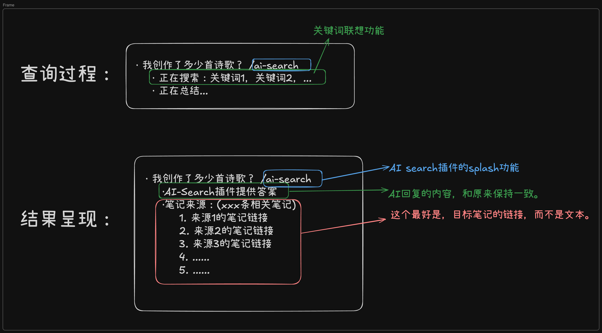

# 🎉🎉🎉 logseq-plugin-AISearch💫💫💫

使用`/`调出AISearch功能，基于该block内容 进行logseq文档内的全局搜索 并输出相关内容。

## How to deploy?
1. 下载源码[repo](https://github.com/chiimagnus/logseq-AIsearch)。
2. 还需要部署[ollama](https://ollama.com/)，下载ollama软件，然后就可以下载到qwen2.5模型啦！`ollama run qwen2.5`。
3. 在 Logseq 插件设置中配置：
   - Ollama 主机地址（默认为 localhost:11434）
   - AI 模型（默认为 qwen2.5）
4. 在项目文件夹终端运行`pnpm install && pnpm run build`。

## How it works?
1. 用户触发搜索：通过`/AI-Search`命令调用。
2. 插件处理：
   - 获取当前block内容
   - 调用AI模型进行内容分析
   - 在文档中搜索相关内容
   - 生成格式化的搜索结果
3. 结果展示：在当前block下方（兄弟block）自动插入搜索结果
4. 在调用之前你还需要打开ollama app，不然会报错：）

## Demo

## TODO
- [ ] 关键词拆分改进，增加类似词语的联想。
- [ ] 允许用户自定义prompt
- [ ] 大功能：UI界面升级，~~类似biji.com AI助手那样~~不了，我想着还是深度结合logseq的block吧。效果这样：
   
- [x] ~~允许用户自定义ollama模型~~
- [x] ~~允许用户自定义ollama API端口~~

## Thanks🙏
1. [logseq插件API文档](https://plugins-doc.logseq.com/)
2. [logseq插件开发实战](https://correctroad.gitbook.io/logseq-plugins-in-action/chapter-1/make-logseq-plugins-support-settings)
3. [logseq-plugins-smartsearch](https://github.com/sethyuan/logseq-plugin-smartsearch)
4. [ollama-logseq](https://github.com/omagdy7/ollama-logseq)
5. [logseq-plugin-link-preview](https://github.com/pengx17/logseq-plugin-link-preview)
6. 非常感谢ollama-logseq的开发者@omagdy7提供的帮助！

<!-- 1. [farfalle](https://github.com/rashadphz/farfalle)
2. [FreeAskInternet](https://github.com/nashsu/FreeAskInternet)
3. [search_with_ai](https://github.com/yokingma/search_with_ai) -->

## Some problems
- [x] ~~CORS 的限制解决方案: https://github.com/omagdy7/ollama-logseq/issues/32~~

## Buy me a coffee☕️

