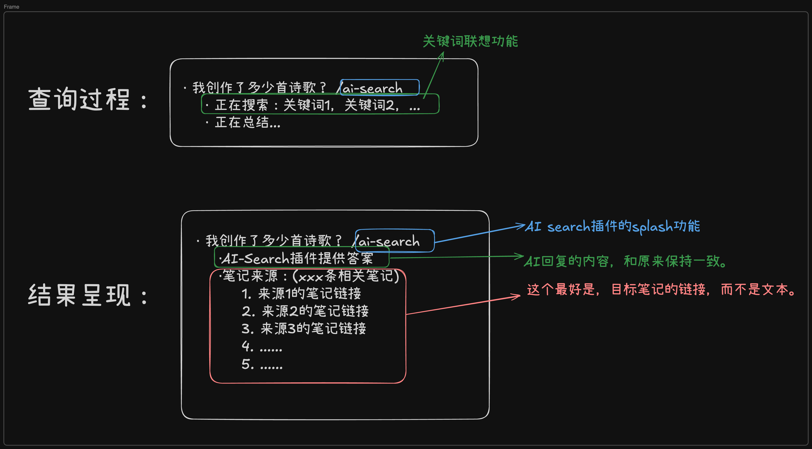

<h1 align="center">
    🎉 logseq-plugin-AISearch
</h1>

    <a href="readme.md">中文</a> | <a href="readme_en.md">English</a>

An AI-based intelligent search plugin for Logseq that can perform global document searches based on the current block content and provide AI-powered summary features.

## ✨ Main Features
- 🔍 Intelligent search based on the current block content
- 📝 AI-powered summary of search results
- 🔗 Quick jump to the original note
- ⚡️ Support for custom AI models and parameters
- 🌐 Added support for the Zhipu Qingyan large model API

## 🚀 Quick Start

### Prerequisites (Choose one)
1. Ollama Local Deployment
   - Install and deploy the [ollama](https://ollama.com/) large model
   - Ensure the ollama service is running properly
2. Zhipu Qingyan API
   - Apply for an API key on the [Zhipu Qingyan Open Platform](https://open.bigmodel.cn/pricing)
   - Obtain model access permissions
   - PS: You can choose the free glm-4-flash model

### Installation and Configuration
1. Install the plugin from the Logseq marketplace
2. Configure parameters based on the chosen method:
   - Ollama Method:
     - Set the host address (default: localhost:11434)
     - Choose the AI model (default: qwen2.5, default 7B parameters)
   - Zhipu Qingyan Method:
     - Configure the API key
     - Choose the model (e.g., glm-4-plus, glm-4-flash)

### Usage
- Command: Enter `/AI-Search`
- Shortcut: `alt+mod+a`
  - Mac: `⌥ + ⌘ + A` (Alt + Command + A)
  - Windows: `Alt + Ctrl + A`

## 📸 Feature Showcase
[demo.mp4](https://github.com/chiimagnus/logseq-AIsearch/blob/master/public/demo.mp4)
or
[demo_bilibili](https://www.bilibili.com/video/BV1pC6wYXE93)

## 🗺️ Development Plan
- [x] Add support for more models
- [x] Optimize AI summary for time dimension
- [x] Support English version prompt

### Completed
- [x] v1.3.0 Added support for the Zhipu Qingyan large model API
- [x] v1.0.0 Core features released
  

    
  

> For more update details, please check [CHANGELOG.md](CHANGELOG.md)

## 🔧 FAQ

- ✅ Performance Optimization: Continuous improvement, striving to balance search accuracy and performance consumption

## 🙏 Acknowledgments
- [Logseq Plugin API Documentation](https://plugins-doc.logseq.com/)
- [Logseq Plugin Development in Action](https://correctroad.gitbook.io/logseq-plugins-in-action/chapter-1/make-logseq-plugins-support-settings)
- [logseq-plugins-smartsearch](https://github.com/sethyuan/logseq-plugin-smartsearch)
- [ollama-logseq](https://github.com/omagdy7/ollama-logseq)
- [logseq-plugin-link-preview](https://github.com/pengx17/logseq-plugin-link-preview)

Special thanks to the ollama-logseq developer [@omagdy7](https://github.com/omagdy7) for helping me solve the CORS issue: [Reference Link](https://github.com/omagdy7/ollama-logseq/issues/32)

## ☕️ Support the Author
[buymeacoffee](https://github.com/chiimagnus/logseq-AIsearch/blob/master/public/buymeacoffee.jpg)

  

